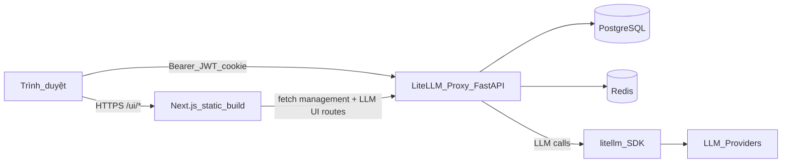

# LiteLLM Control Plane: Giao diện Web (Admin UI)

Tài liệu này mô tả lớp **Control Plane / Admin UI** của LiteLLM: giao diện web dùng để quản trị gateway, cấp virtual key, theo dõi usage, và cấu hình các tính năng nâng cao. Nó bổ sung cho [`giai-thich.md`](giai-thich.md) (luồng proxy, Bedrock, virtual key, quota) và [`ARCHITECTURE.md`](ARCHITECTURE.md) (kiến trúc SDK + AI Gateway)

## 1. Control Plane là gì?

Trong LiteLLM, **Control Plane** có hai nghĩa liên quan:

**Giao diện web (Admin UI)** là ứng dụng Next.js trong [`ui/litellm-dashboard/`](ui/litellm-dashboard/). User đăng nhập qua trình duyệt, thao tác với proxy qua REST API thay vì gọi curl trực tiếp. UI được build thành static assets rồi mount vào proxy tại `/ui/` (mặc định `http://localhost:4000/ui/` khi chạy local)



Luồng điển hình:

1. User mở `/ui/` hoặc `/ui/login`
2. SSO hoặc username/password tạo JWT lưu trong cookie `token` (httpOnly khi có thể)
3. Mỗi trang dashboard decode JWT qua [`useAuthorized`](ui/litellm-dashboard/src/app/(dashboard)/hooks/useAuthorized.ts), lấy `accessToken` (virtual key phiên UI), `user_id`, `user_role`
4. HTTP client [`src/lib/http/client.ts`](ui/litellm-dashboard/src/lib/http/client.ts) gọi proxy với `Authorization: Bearer {accessToken}`
5. Proxy xác thực và thực thi CRUD / analytics tương ứng

Dev local: chạy proxy (`python litellm/proxy/proxy_cli.py ...`) và dashboard riêng (`npm run dev` trong `ui/litellm-dashboard`, port 3000). Production: build UI (`npm run build`) rồi proxy phục vụ bundle tại `/ui/`

## 2. Công nghệ lớp Frontend

| Hạng mục | Công nghệ | Ghi chú |
|----------|-----------|---------|
| Framework | **Next.js 16** (App Router) | Route theo thư mục `src/app/(dashboard)/` |
| UI runtime | **React 18** | Client components cho hầu hết trang dashboard |
| Styling | **Tailwind CSS 4**, **CVA** | Sidebar redesign dùng `@/components/ui/*` |
| Component libs | **Ant Design 5**, **Tremor**, **Lucide**, **@base-ui/react** | Ant Design/Tremor cho form bảng cũ; UI mới dần chuyển sang shadcn-style |
| Data fetching | **TanStack Query v5**, **openapi-fetch** | Hooks trong `app/(dashboard)/hooks/` |
| Bảng / biểu đồ | **TanStack Table**, **Recharts** | Usage, logs, teams |
| API types | **openapi-typescript** | `npm run gen:api` sinh [`schema.d.ts`](ui/litellm-dashboard/src/lib/http/schema.d.ts) từ OpenAPI proxy |
| Auth | **JWT** (`jwt-decode`), cookie | Không lưu API key LLM vào `localStorage` |
| Test | **Vitest**, **Testing Library**, **Playwright** | Unit + e2e trong `e2e_tests/` |
| Node | **>= 20.9** | Xem `package.json` |

Kiến trúc code dashboard (theo [`ui/litellm-dashboard/src/app/(dashboard)/README.md`](ui/litellm-dashboard/src/app/(dashboard)/README.md)):

- Mỗi trang sidebar = một folder + `page.tsx`
- Logic gọi API nằm trong `hooks/` (TanStack Query)
- Component presentational trong `_components/` hoặc `components/`
- Một HTTP client duy nhất; không gọi `fetch()` trực tiếp ngoài `src/lib/http/`

**Plugin mode:** [`PluginModeContext`](ui/litellm-dashboard/src/contexts/PluginModeContext.tsx) cho phép nhúng plugin bên thứ ba qua iframe (Agent Control Plane). Khi `mode !== "ai-gateway"`, layout dùng Navbar cũ và iframe thay vì sidebar AI Gateway

## 3. Vai trò người dùng (RBAC)

Định nghĩa role trong [`src/utils/roles.ts`](ui/litellm-dashboard/src/utils/roles.ts). Sidebar lọc menu theo role trong [`leftnav.tsx`](ui/litellm-dashboard/src/components/leftnav.tsx)

| Role (hiển thị UI) | Mô tả ngắn |
|--------------------|------------|
| **Admin** / `proxy_admin` | Toàn quyền cấu hình gateway, user, model, settings |
| **Admin Viewer** / `proxy_admin_viewer` | Đọc gần như Admin; không tạo key, không Playground (tránh phát sinh chi phí), không ghi budget |
| **Org Admin** / `org_admin` | Quản lý trong phạm vi organization (user, team liên quan) |
| **Internal User** / `internal_user` | Developer nội bộ: tạo key, dùng Playground, xem usage/logs theo policy |
| **Internal Viewer** | Chỉ đọc; subset trang do admin bật qua UI Access Control |

Nguyên tắc **Admin Viewer read parity**: xem Models, Agents, Budgets, Virtual Keys; không thao tác ghi và không Playground

Admin có thể giới hạn trang Internal User thấy qua **UI Access Control** (`enabled_ui_pages_internal_users` trong Admin Settings). Các flag khác: `enable_projects_ui`, `enable_chat_ui`, `disable_agents_for_internal_users`, `allow_agents_for_team_admins`, tương tự cho vector stores

**Team admin** (role `admin` trong team): có thể quản lý team/key của team mình; một số trang (Agents, Vector Stores) mở thêm nếu admin bật `allow_*_for_team_admins`

## 4. Tính năng theo nhóm (Admin vs User)

Cấu trúc menu lấy từ sidebar. Cột **Admin** = `proxy_admin` / Admin (và thường cả Admin Viewer cho phần đọc). Cột **User** = Internal User / Internal Viewer / team member thông thường

### 4.1 AI Gateway

| Trang | Route | Admin làm được | User làm được |
|-------|-------|----------------|---------------|
| **Virtual Keys** | `/ui/` (mặc định), `/ui/api-keys` | Xem mọi key; tạo key cho user/team/service account; set budget, TPM/RPM, models, guardrails, MCP, agents, metadata | Xem key của mình/team; tạo key cá nhân (trừ khi bị `disabled_non_admin_personal_key_creation`); gán team, models theo quota org/team |
| **Playground** | `/ui/playground` | Chat, Compare models, Compliance test, Agent Builder (experimental) qua proxy thật | Cùng các tab (role có write access); tốn tiền LLM thật |
| **Chat** | `/ui/chat` | Giao diện chat end-user (Responses API, MCP, chọn model) | Dùng khi admin bật `enable_chat_ui` |
| **Models + Endpoints** | `/ui/models-and-endpoints` | Thêm/sửa/xóa deployment; credentials provider; health check; retry policy; model alias; pass-through; custom pricing | Admin Viewer: xem read-only. Internal User: thường không thấy menu (write-scoped) |
| **Agentic → Agents** | `/ui/agents` | CRUD agent, gán team, permission | Team admin / internal user nếu policy cho phép |
| **Agentic → Workflow Runs** | `/ui/workflows` | Xem workflow runs (deprecated banner) | Xem runs liên quan |
| **Agentic → Memory** | `/ui/memory` | Quản lý memory store cho agent | Theo quyền team/key |
| **MCP Servers** | `/ui/mcp-servers` | Đăng ký MCP server, OAuth, toolsets, test tool | Kết nối MCP được phép trên key/team |
| **Skills** | `/ui/skills` | Quản lý Claude Code plugins/skills (admin only) | Không |
| **Guardrails** | `/ui/guardrails` | Thêm guardrail (Presidio, Bedrock, custom code, Guardrail Garden); gán team; test playground | Xem/ dùng guardrail đã gán; team guardrails tab |
| **Policies** | `/ui/policies` | Policy engine (admin only) | Không |
| **Tools → Search Tools** | `/ui/search-tools` | Cấu hình search tool providers | Theo team/key |
| **Tools → Vector Stores** | `/ui/vector-stores` | Tạo/quản lý vector store | Internal user nếu không bị disable; team admin nếu được phép |
| **Tools → Tool Policies** | `/ui/tool-policies` | Policy cho tool calling | Theo role team |

**Virtual Keys (chi tiết):** form tạo key ([`create_key_button.tsx`](ui/litellm-dashboard/src/components/organisms/create_key_button.tsx)) hỗ trợ: alias, team/org/project, loại key (`default`, `llm_api`, `management`), models (wildcard), `max_budget`, budget duration/windows, TPM/RPM/parallel limits, guardrails, policies, MCP permissions, agents, vector stores, pass-through routes, router overrides, tag rate limits, metadata. Plaintext key chỉ hiện một lần lúc tạo (giống API `/key/generate` trong [`giai-thich.md`](giai-thich.md))

### 4.2 Observability

| Trang | Route | Admin | User |
|-------|-------|-------|------|
| **Usage** | `/ui/usage` | Dashboard spend theo team/org/key/model; biểu đồ; AI chat phân tích usage | Internal User/Viewer: usage phạm vi được phép |
| **Logs** | `/ui/logs` | Spend logs toàn hệ thống; filter; chi tiết request/response | Logs của key/user/team mình |
| **Guardrails Monitor** | `/ui/guardrails-monitor` | Theo dõi guardrail violations | Internal roles nếu được bật |

Trang **Logs** dùng [`SpendLogsTable`](ui/litellm-dashboard/src/components/view_logs): xem latency, cost, model, status, mở drawer chi tiết (messages, guardrail hits, eval). Admin có filter rộng hơn

### 4.3 Access Control

| Trang | Route | Admin | User |
|-------|-------|-------|------|
| **Teams** | `/ui/teams` | Tạo/sửa/xóa team; members; models; budget; guardrails; MCP; SSO team settings | Xem team tham gia; team admin chỉnh team của mình |
| **Projects** | `/ui/projects` | Quản lý project, keys theo project | Chỉ khi `enable_projects_ui` |
| **Internal Users** | `/ui/users` | CRUD user; invite/onboarding; bulk edit; default settings | Org Admin: subset user trong org |
| **Organizations** | `/ui/organizations` | Multi-tenant org, members, models | Org Admin trong org |
| **Access Groups** | `/ui/access-groups` | Nhóm quyền truy cập model/resource | Không |
| **Budgets** | `/ui/budgets` | Tạo budget template; gán end-user; ví dụ curl/SDK | Admin Viewer: xem only |

**Teams (chi tiết):** [`Teams.tsx`](ui/litellm-dashboard/src/components/Teams.tsx) cho phép admin/org admin cấu hình team alias, models, spend limits, guardrails, policies, MCP servers/tools, agents, vector stores, search tools, router settings, model aliases, premium logging

### 4.4 Developer Tools

| Trang | Route | Admin | User |
|-------|-------|-------|------|
| **API Reference** | `/ui/api-reference` | OpenAPI docs proxy tích hợp | Xem docs |
| **AI Hub** | `/ui/model-hub-table` | Catalog model public; publish MCP | Khám phá model |
| **Learning Resources** | external | Link cookbook | Link cookbook |
| **Experimental → Caching** | `/ui/caching` | Cấu hình LLM response cache | Admin only |
| **Experimental → Prompts** | `/ui/prompts` | Prompt templates | Admin only |
| **Experimental → API Playground** | `/ui/transform-request` | Gửi request thô, xem transform | Admin + Internal User |
| **Experimental → Tag Management** | `/ui/tag-management` | Tag cho routing/analytics | Admin only |
| **Experimental → Old Usage** | `/ui/old-usage` | Usage UI legacy | Fallback |

### 4.5 Settings (Admin only)

| Trang | Route | Chức năng |
|-------|-------|-----------|
| **Router Settings** | `/ui/router-settings` | Routing strategy, fallbacks, cooldowns, rate limits toàn cục |
| **Logging & Alerts** | `/ui/logging-and-alerts` | Callbacks (Langfuse, Slack, …), alerting |
| **Admin Settings** | `/ui/admin-panel` | SSO (Google/Microsoft/generic), allowed IPs, SCIM, UI branding, Hashicorp Vault, plugin URLs, UI Access Control |
| **Cost Tracking** | `/ui/cost-tracking` | CloudZero, custom pricing, pricing calculator, export |
| **UI Theme** | `/ui/ui-theme` | Logo, màu, white-label |

**Admin Panel tabs:** SSO Settings, Security Settings (IP allowlist, UI access), SCIM provisioning, UI Settings, Logging, Hashicorp Vault, Plugin Settings

## 5. Luồng đăng nhập và bảo mật UI

| Cơ chế | File / endpoint | Mô tả |
|--------|-----------------|-------|
| Login UI | `/ui/login`, [`ui_sso.py`](litellm/proxy/management_endpoints/ui_sso.py) | Username/password hoặc SSO; JWT session |
| SSO redirect | `AUTO_REDIRECT_UI_LOGIN_TO_SSO` | Tự redirect nếu SSO đã cấu hình |
| Tắt UI | `DISABLE_ADMIN_UI=true` | `admin_ui_disabled` trong ui-config |
| UI config discovery | `GET /.well-known/litellm-ui-config` | `server_root_path`, `proxy_base_url`, SSO flags |
| Cross-origin SSO | `control_plane_url` + `/v3/login/exchange` | Control plane redeem login code từ worker |
| Session token | team_id `litellm-dashboard` | Key UI session tách khỏi key end-user |

Cookie `token` mang JWT; `useAuthorized` extract `accessToken` (sk-…) để gọi API. Hết hạn token redirect về login, giữ `returnUrl`

## 6. Admin vs User: tóm tắt theo nhu cầu

**Proxy Admin** dùng UI để:

- Onboard developer (Users, invite link, SSO/SCIM)
- Khai báo model Bedrock/OpenAI/… và credentials (Models + Endpoints)
- Cấp virtual key có quota cho Claude Code / SDK (Virtual Keys)
- Giám sát spend và debug request (Usage, Logs)
- Bật guardrails, MCP, agents cho team
- Cấu hình router, alerts, theme, cost tracking

**Internal User (developer)** dùng UI để:

- Lấy hoặc tạo virtual key cho mình (Virtual Keys)
- Test model nhanh (Playground, Chat nếu bật)
- Xem usage/logs của key mình
- Tham gia team, xem model được phép
- Kết nối MCP / vector store theo policy team

**Admin Viewer / Internal Viewer** chủ yếu **đọc**: audit key, model config, usage, logs; không tạo key, không Playground

## 7. Liên kết với tài liệu khác

| Chủ đề | Tài liệu / code |
|--------|-----------------|
| Virtual key, quota, Bedrock | [`giai-thich.md`](giai-thich.md) |
| Proxy request flow, hooks, Redis/Postgres | [`ARCHITECTURE.md`](ARCHITECTURE.md) |
| Sidebar menu + RBAC | [`leftnav.tsx`](ui/litellm-dashboard/src/components/leftnav.tsx), [`roles.ts`](ui/litellm-dashboard/src/utils/roles.ts) |
| Mount UI vào proxy | [`proxy_server.py`](litellm/proxy/proxy_server.py) (~dòng 1574+) |
| Management API (key, user) | [`key_management_endpoints.py`](litellm/proxy/management_endpoints/key_management_endpoints.py), [`internal_user_endpoints.py`](litellm/proxy/management_endpoints/internal_user_endpoints.py) |
| Dashboard conventions | [`ui/litellm-dashboard/src/app/(dashboard)/README.md`](ui/litellm-dashboard/src/app/(dashboard)/README.md) |

## 8. Chạy thử nhanh

**Chỉ proxy (UI bundled):**

```bash
python litellm/proxy/proxy_cli.py --config litellm/proxy/dev_config.yaml --detailed_debug --reload
```

Mở `http://localhost:4000/ui/`

**Dev dashboard hot reload:**

```bash
cd ui/litellm-dashboard
npm run dev
```

Mở `http://localhost:3000` (dashboard gọi proxy qua `getProxyBaseUrl()`)

**Regenerate API types sau khi đổi backend route:**

```bash
cd ui/litellm-dashboard
npm run gen:api
```
