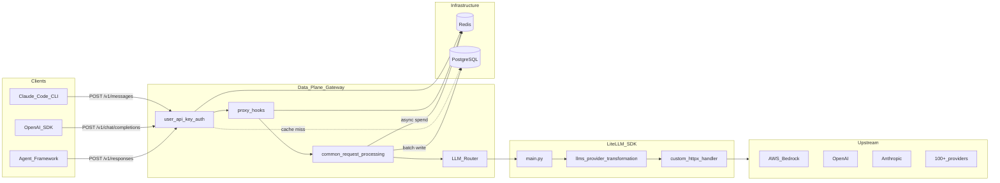
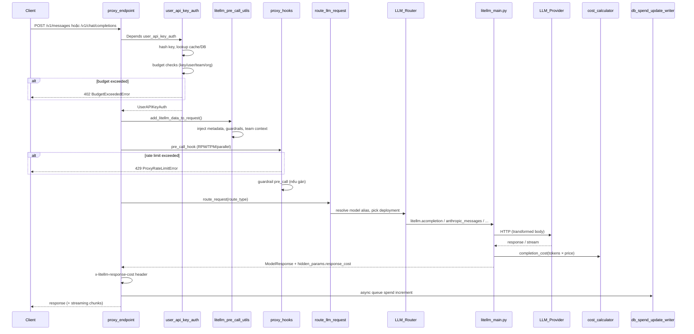
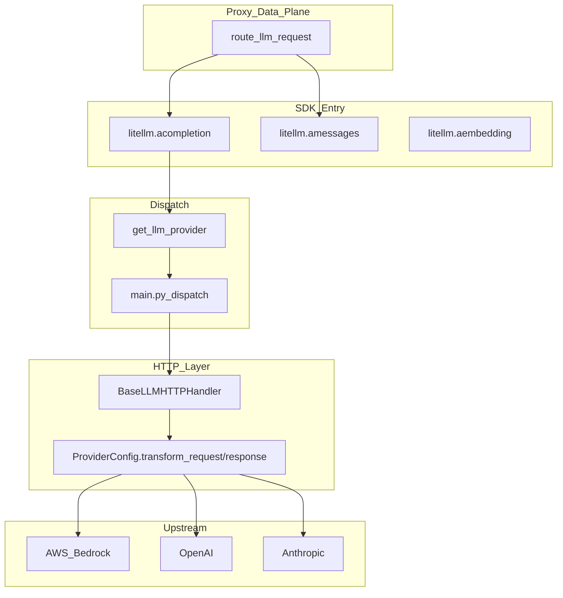
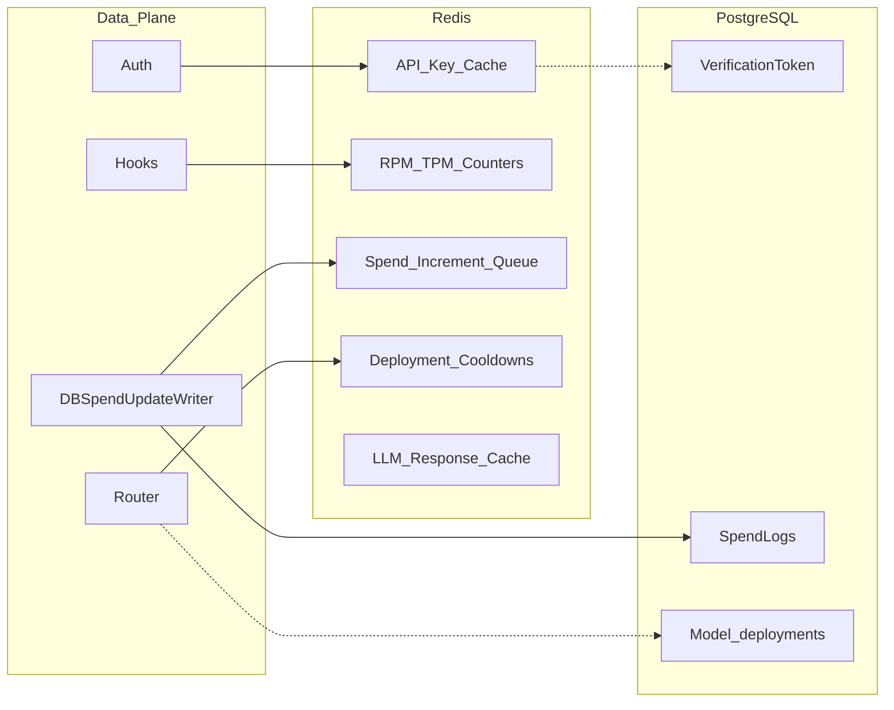

# LiteLLM Data Plane: AI Gateway và luồng LLM

Tài liệu này mô tả lớp **Data Plane** của LiteLLM: mọi đường dẫn HTTP phục vụ client gọi LLM (chat, embeddings, messages, passthrough provider, MCP tool-call, realtime, …). Nó bổ sung cho [`control-plane.md`](control-plane.md) (Admin UI + management API), [`giai-thich.md`](giai-thich.md) (virtual key, quota, Bedrock, Claude Code), và [`ARCHITECTURE.md`](ARCHITECTURE.md) (kiến trúc SDK + proxy request flow)

## 1. Data Plane là gì?

Trong LiteLLM, **Data Plane** là tầng xử lý **traffic LLM thực tế**: nhận request từ client (Claude Code, OpenAI SDK, curl, agent framework), xác thực virtual key, enforce quota/guardrails, route tới deployment upstream, gọi LiteLLM SDK, rồi trả response (streaming hoặc non-streaming) kèm cost headers và ghi spend logs

**Control Plane** (xem [`control-plane.md`](control-plane.md)) quản lý cấu hình: tạo key, user, team, model deployment, guardrail policy, router settings. Data Plane **đọc** cấu hình đó (qua PostgreSQL + Redis cache) nhưng không expose các route `/key/*`, `/user/*`, `/team/*` khi chạy ở chế độ tách component



### Monolith vs tách component

Mặc định local dev, một process FastAPI (`litellm/proxy/proxy_cli.py`) phục vụ **cả** data plane lẫn control plane trên port 4000

Production có thể tách thành ba deployable (xem [`terraform/litellm/README.md`](terraform/litellm/README.md), [`gateway/routes/allowlist.py`](gateway/routes/allowlist.py), [`backend/routes/allowlist.py`](backend/routes/allowlist.py)):

| Component | Image mặc định | Port | Vai trò |
|-----------|----------------|------|---------|
| **gateway** | `litellm-gateway` | 4000 | Data plane: `/v1/chat/*`, `/v1/messages`, `/embeddings`, passthrough provider, MCP tool-call, … |
| **backend** | `litellm-backend` | 4001 | Control plane: `/key/*`, `/user/*`, `/team/*`, `/model/*`, `/spend/*`, … |
| **ui** | `litellm-ui` | 3000 | Static Admin UI tại `/ui/` |

Load balancer route theo path prefix: LLM routes → gateway; management routes → backend; static assets → ui. E2E harness dùng `SplitTransport` ([`tests/e2e/transport.py`](tests/e2e/transport.py)) để test split deployment mà không đổi test code

Có thể tắt toàn bộ LLM API trên một instance bằng `DISABLE_LLM_API_ENDPOINTS=true` (chỉ giữ management/UI)

## 2. Bề mặt API (route allowlist)

Data plane expose các nhóm endpoint sau. Danh sách chính thức nằm trong [`gateway/routes/allowlist.py`](gateway/routes/allowlist.py); mọi path **không** nằm trong allowlist bị drop khỏi gateway process

### 2.1 OpenAI-compatible

| Nhóm | Path prefix | Mục đích |
|------|-------------|----------|
| Chat | `/v1/chat/`, `/chat/` | Chat Completions (`POST /v1/chat/completions`) |
| Completions | `/v1/completions`, `/completions` | Legacy text completion |
| Embeddings | `/v1/embeddings`, `/embeddings` | Vector embeddings |
| Images | `/v1/images/`, `/images/` | Image generation / edit |
| Audio | `/v1/audio/`, `/audio/` | Speech, transcription |
| Moderations | `/v1/moderations`, `/moderations` | Content moderation |
| Files | `/v1/files`, `/files` | File upload (OpenAI Files API) |
| Batches | `/v1/batches`, `/batches` | Batch inference jobs |
| Fine-tuning | `/v1/fine_tuning/`, `/fine-tuning/` | Fine-tuning jobs |
| Responses | `/v1/responses`, `/responses` | OpenAI Responses API |
| Assistants / Threads | `/v1/assistants`, `/v1/threads` | Assistants API surface |
| Vector stores | `/v1/vector_stores`, `/vector_stores` | Vector store CRUD + search |
| Models | `/v1/models`, `/models` | Model list (theo key permission) |
| Realtime | `/v1/realtime`, `/realtime` | WebSocket realtime sessions |

### 2.2 Anthropic / agentic

| Nhóm | Path | Mục đích |
|------|------|----------|
| Messages | `/v1/messages`, `/messages` | Anthropic Messages API; **Claude Code** dùng endpoint này |
| Skills | `/v1/skills` | Skills injection (Claude Code plugins) |
| A2A | `/v1/a2a/` | Agent-to-agent protocol |
| Memory | `/v1/memory` | Agent memory store operations |

Implementation chính: [`litellm/proxy/anthropic_endpoints/endpoints.py`](litellm/proxy/anthropic_endpoints/endpoints.py). Endpoint lazy-load qua [`litellm/proxy/_lazy_features.py`](litellm/proxy/_lazy_features.py) khi request khớp `/v1/messages`, `/anthropic`, hoặc `/claude-code`

### 2.3 LiteLLM-native

| Nhóm | Path | Mục đích |
|------|------|----------|
| Rerank | `/v1/rerank`, `/v2/rerank`, `/rerank` | Reranking |
| OCR | `/v1/ocr`, `/ocr` | Document OCR |
| RAG | `/v1/rag/` | RAG pipelines |
| Video | `/v1/video`, `/v1/videos`, `/videos` | Video generation |
| Search | `/v1/search`, `/search` | Search tools |
| Containers | `/v1/containers`, `/containers` | Code interpreter containers |
| Queue | `/queue/chat/` | Queued chat (experimental) |

### 2.4 Provider passthrough

Proxy có thể forward request **nguyên format** tới provider mà không qua OpenAI transform:

| Prefix | Provider |
|--------|----------|
| `/anthropic/` | Anthropic native |
| `/bedrock/`, `/aws/` | AWS Bedrock |
| `/gemini/`, `/google/`, `/v1beta/` | Google AI Studio |
| `/vertex_ai/`, `/vertex-ai/` | Google Vertex AI |
| `/azure/`, `/azure_ai/` | Azure OpenAI / Azure AI |
| `/cohere/`, `/groq/`, `/mistral/`, `/voyage/`, … | Các provider khác |
| `/{provider}/` | Dynamic passthrough theo tên provider |
| `/toolset/` | Toolset passthrough |

Code: [`litellm/proxy/pass_through_endpoints/`](litellm/proxy/pass_through_endpoints/)

### 2.5 MCP (runtime)

MCP **admin** (đăng ký server, OAuth BYOK) thuộc control plane (`/v1/mcp/` trên backend). MCP **runtime** (list tools, call tool khi agent đang chạy) thuộc data plane: `/mcp/{server_name}`, dynamic toolset routes. Xem [`litellm/proxy/_experimental/mcp_server/`](litellm/proxy/_experimental/mcp_server/)

### 2.6 Ops

| Path | Mục đích |
|------|----------|
| `/health` | Health check (DB, Redis, deployments) |
| `/metrics` | Prometheus metrics (có thể yêu cầu auth) |

## 3. Luồng request end-to-end

Luồng chuẩn cho mọi endpoint LLM (chat, messages, embeddings, …) đi qua cùng pipeline trong [`litellm/proxy/common_request_processing.py`](litellm/proxy/common_request_processing.py)



**Điểm vào theo client:**

| Client | Endpoint gọi | `route_type` nội bộ |
|--------|--------------|---------------------|
| OpenAI SDK | `POST /v1/chat/completions` | `acompletion` |
| Claude Code | `POST /v1/messages` | `anthropic_messages` |
| Responses API client | `POST /v1/responses` | `aresponses` |
| Embedding client | `POST /v1/embeddings` | `aembedding` |

Mapping đầy đủ: [`litellm/proxy/route_llm_request.py`](litellm/proxy/route_llm_request.py) (`ROUTE_ENDPOINT_MAPPING`)

## 4. Xác thực trên Data Plane

Mọi endpoint LLM gắn dependency [`user_api_key_auth`](litellm/proxy/auth/user_api_key_auth.py)

### 4.1 Đọc credential

Thứ tự ưu tiên header:

1. `X-LiteLLM-Key`
2. `Authorization: Bearer sk-...`
3. `x-api-key` (OpenAI convention)

Virtual key phải có prefix `sk-`. Token được hash SHA-256 rồi lookup trong `UserApiKeyCache` (in-memory + Redis) hoặc PostgreSQL (`LiteLLM_VerificationToken`). Chi tiết data model: [`giai-thich.md` §4](giai-thich.md)

### 4.2 `UserAPIKeyAuth`

Sau auth thành công, object `UserAPIKeyAuth` mang context enforcement:

- `user_id`, `team_id`, `organization_id`, `project_id`
- `models[]` được phép (hoặc wildcard)
- `max_budget`, `tpm_limit`, `rpm_limit`, `max_parallel_requests`
- `budget_limits`, `model_max_budget`, tag limits
- `guardrails`, `policies`, MCP permissions, agents
- `allowed_routes` (giới hạn nhóm route: `openai_routes`, `mcp_routes`, …)

### 4.3 Route permission

[`RouteChecks`](litellm/proxy/auth/route_checks.py) kiểm tra key có được gọi route group tương ứng không. Ví dụ key loại `management` hoặc key chỉ có `allowed_routes=["mcp_routes"]` sẽ bị từ chối `/v1/chat/completions`

### 4.4 Model permission

[`can_key_call_model`](litellm/proxy/auth/auth_checks.py) xác nhận model trong request nằm trong allow-list của key/team/org. Router có thể block deployment nếu tất cả deployment của model đang cooldown

## 5. Quota và rate limiting

Data plane enforce quota qua **ba lớp** tuần tự (chi tiết: [`giai-thich.md` §5](giai-thich.md))

### 5.1 Lớp A: Auth-time budget checks

Chạy trong `user_api_key_auth` **trước** handler endpoint:

| Scope | Counter Redis | Nguồn limit |
|-------|---------------|-------------|
| Key | `spend:key:{token}` | `max_budget`, `budget_limits` |
| User | `spend:user:{user_id}` | `user.max_budget` |
| Team | `spend:team:{team_id}` | `team.max_budget` |
| Org | `spend:org:{org_id}` | `organization.max_budget` |
| Tag / end-user / model | các counter tương ứng | metadata và per-model budget |

Vượt budget → HTTP 402 (`BudgetExceededError`). Tùy chọn **budget throttle** ([`budget_throttle.py`](litellm/proxy/auth/budget_throttle.py)): giảm TPM/RPM thay vì block cứng khi `metadata.throttle_on_budget_exceeded: true`

### 5.2 Lớp B: Pre-call hooks

[`proxy_logging_obj.pre_call_hook()`](litellm/proxy/common_request_processing.py) gọi các hook đăng ký trong [`PROXY_HOOKS`](litellm/proxy/hooks/__init__.py):

| Hook | File | Chức năng |
|------|------|-----------|
| `parallel_request_limiter` | `parallel_request_limiter_v3.py` | RPM, TPM, max parallel requests (Redis sliding window 60s, Lua atomic) |
| `max_budget_limiter` | `max_budget_limiter.py` | Budget reservation trước call |
| `max_budget_per_session_limiter` | `max_budget_per_session_limiter.py` | Budget theo session |
| `max_iterations_limiter` | `max_iterations_limiter.py` | Giới hạn vòng lặp agent |
| `cache_control_check` | `cache_control_check.py` | Validate cache_control params |
| `responses_id_security` | `responses_id_security.py` | Bảo vệ response ID cross-tenant |
| `litellm_skills` | `skills_injection.py` | Inject Claude Code skills |
| `sensitive_data_routing` | `sensitive_data_routing.py` | Route theo độ nhạy cảm dữ liệu |

Vượt RPM/TPM/parallel → HTTP 429 (`ProxyRateLimitError`). Response có header `x-ratelimit-*` báo remaining

### 5.3 Lớp C: Post-call spend tracking

Sau response:

1. SDK tính cost qua [`cost_calculator.py`](litellm/cost_calculator.py) → `response._hidden_params["response_cost"]`
2. Proxy thêm header `x-litellm-response-cost`
3. [`DBSpendUpdateWriter`](litellm/proxy/db/db_spend_update_writer.py) queue increment vào Redis
4. Background job `update_spend` (60s) flush sang PostgreSQL (`LiteLLM_SpendLogs`)
5. [`budget_reservation.py`](litellm/proxy/spend_tracking/budget_reservation.py) reconcile estimate vs actual cost

## 6. Routing và reliability

### 6.1 Model alias → deployment

Admin khai báo `model_list` trong config YAML hoặc qua UI (`POST /model/new` trên control plane). Mỗi entry map **alias** (tên client gọi) sang upstream model + credentials:

```yaml
  - model_name: bedrock-converse-sonnet-4-6
    litellm_params:
      model: bedrock/converse/us.anthropic.claude-sonnet-4-6
      aws_region_name: us-east-1
```

[`litellm.Router`](litellm/router.py) (khởi tạo trong [`proxy_server.py`](litellm/proxy/proxy_server.py)) chọn deployment theo strategy:

| Strategy | File | Hành vi |
|----------|------|---------|
| `simple-shuffle` | `router_strategy/simple_shuffle.py` | Random weighted |
| `lowest-latency` | `router_strategy/lowest_latency.py` | Ưu tiên deployment latency thấp |
| `lowest-cost` | `router_strategy/lowest_cost.py` | Ưu tiên cost thấp |
| `usage-based-routing` | `router_strategy/usage_based_routing.py` | Theo TPM usage |
| `least-busy` | `router_strategy/least_busy.py` | Deployment ít tải nhất |

### 6.2 Fallbacks và cooldown

- **Fallbacks**: khi deployment trả lỗi (5xx, context window, content policy), router thử deployment/model fallback theo config
- **Cooldowns**: deployment lỗi nhiều lần bị đưa vào cooldown (lưu Redis); router bỏ qua cho đến khi hết hạn
- **Health check**: `_run_background_health_check` liên tục probe deployment; unhealthy deployment bị loại khỏi pool

Router cache (`Router.cache: DualCache`) theo dõi TPM/RPM per deployment, cooldown state, và client-side caching metadata

### 6.3 Per-key router override

Virtual key có thể mang `router_settings` riêng (strategy, fallbacks) override config global. Control plane ghi vào DB; data plane đọc qua `add_litellm_data_to_request()` trong [`litellm_pre_call_utils.py`](litellm/proxy/litellm_pre_call_utils.py)

## 7. LiteLLM SDK và translation layer

Data plane **không** gọi provider trực tiếp; mọi LLM call đi qua SDK (`litellm/main.py`)



### 7.1 Translation

Mỗi provider có `Config` class kế thừa `BaseConfig` ([`llms/base_llm/chat/transformation.py`](litellm/llms/base_llm/chat/transformation.py)):

- `transform_request()`: OpenAI/Anthropic format → provider format
- `transform_response()`: provider format → `ModelResponse` chuẩn

Bảng translation theo API surface: [`ARCHITECTURE.md` §3](ARCHITECTURE.md). Ví dụ Bedrock Converse: [`llms/bedrock/chat/converse_transformation.py`](litellm/llms/bedrock/chat/converse_transformation.py)

### 7.2 Bedrock (use case phổ biến)

[`giai-thich.md` §2](giai-thich.md) mô tả nhánh Bedrock:

| Route | AWS API | Khi nào |
|-------|---------|---------|
| `converse` | `/model/{id}/converse` | Claude 3+/4+, Nova (mặc định) |
| `invoke` | `/model/{id}/invoke` | Legacy / model không hỗ trợ converse |
| `claude_platform` | Anthropic Messages qua AWS | Prefix `bedrock/claude_platform/` |

Credentials: env vars, IAM role, AssumeRole, profile; signing SigV4 qua [`base_aws_llm.py`](litellm/llms/bedrock/base_aws_llm.py)

## 8. Guardrails trên Data Plane

Guardrail **cấu hình** (CRUD, gán team) thuộc control plane (`/v2/guardrails/`). Guardrail **thực thi** chạy trên data plane trong pre/post call hooks

Registry: [`litellm/proxy/guardrails/guardrail_registry.py`](litellm/proxy/guardrails/guardrail_registry.py)

| Integration | Hook points | Hành vi |
|-------------|-------------|---------|
| Presidio | `pre_call`, `post_call` | Mask PII |
| Lakera / Lakera V2 | `pre_call`, `post_call` | Content moderation |
| Bedrock Guardrails | `pre_call`, `post_call` | AWS Bedrock policy |
| Tool Permission | `pre_call` | Kiểm soát tool calling |
| LLM-as-a-Judge | `post_call` | Đánh giá output bằng LLM |
| Custom code | configurable | User-defined guardrail class |

Guardrail gán trên virtual key / team / global được inject vào `request_data` qua `add_litellm_data_to_request()`. Violation có thể block request, mask content, hoặc chỉ log (`logging_only` hook). Header response có thể chứa guardrail đã áp dụng

## 9. Caching

Hai tầng cache độc lập:

| Tầng | Class | Mục đích | Storage |
|------|-------|----------|---------|
| **LLM response cache** (SDK) | `LLMCachingHandler` / `Cache` | Cache completion/embedding theo prompt | Redis (`LLMResponseCache`) |
| **Proxy infra cache** | `InternalUsageCache`, `DualCache` | API key, rate limit counters, spend queue, deployment cooldown | In-memory + Redis |

Admin bật LLM cache qua control plane (Experimental → Caching). Client có thể gửi `cache_control` (Anthropic/Bedrock prompt caching) được translate ở tầng provider transformation

## 10. Streaming

Streaming đi qua [`litellm_core_utils/streaming_handler.py`](litellm/litellm_core_utils/streaming_handler.py). Proxy wrap trong `StreamingResponse` ([`common_request_processing.py`](litellm/proxy/common_request_processing.py)):

- SSE format với prefix `data: ` (`STREAM_SSE_DATA_PREFIX`)
- Cost attribution chạy sau chunk cuối (hoặc khi client disconnect)
- Guardrail `during_call` hook có thể xử lý từng chunk
- Client disconnect được ghi `client_disconnected` vào metadata logging

Claude Code và hầu hết SDK dùng `stream: true`; Bedrock Converse dùng `/converse-stream`

## 11. Observability trên Data Plane

| Cơ chế | Mô tả | File / config |
|--------|-------|---------------|
| Spend logs | Mỗi request ghi latency, cost, model, status, messages (redacted) | `LiteLLM_SpendLogs`, xem qua UI Logs |
| Response headers | `x-litellm-response-cost`, `x-ratelimit-*`, retry/fallback headers | `get_response_headers()` |
| Callbacks | Langfuse, Datadog, S3, OTEL, Prometheus, Slack alerts | `integrations/`, config qua UI Logging & Alerts |
| OTEL tracing | Span per request + streaming chunks | `integrations/otel/` |
| Prometheus | `/metrics` endpoint | `prometheus.py` |

Control plane đọc spend logs qua `/spend/logs`; data plane **ghi** async, không block response path

## 12. Infrastructure phụ thuộc



| Component | Vai trò trên data plane |
|-----------|------------------------|
| **Redis** | Bắt buộc cho multi-instance: rate limit atomic, key cache, spend queue, cooldowns, LLM cache |
| **PostgreSQL** | Nguồn truth cho key/team/deployment config; spend logs persistence |
| **S3/GCS** (optional) | Callback log storage, batch files |

Background jobs (APScheduler trên gateway): `update_spend` (60s), health check deployments, budget reset. Chi tiết: [`ARCHITECTURE.md` §1](ARCHITECTURE.md)

## 13. Client điển hình

### 13.1 Claude Code → Bedrock

```bash
export ANTHROPIC_BASE_URL=http://localhost:4000
export ANTHROPIC_API_KEY=sk-{virtual_key}
```

Claude Code gọi `POST /v1/messages` với model alias (`bedrock-converse-sonnet-4-6`). Proxy auth + quota + route → Bedrock Converse. E2E: [`tests/e2e/claude_code/`](tests/e2e/claude_code/)

### 13.2 OpenAI SDK

```python
from openai import OpenAI
client = OpenAI(base_url="http://localhost:4000", api_key="sk-{virtual_key}")
client.chat.completions.create(model="gpt-4o", messages=[{"role": "user", "content": "hi"}])
```

Gọi `POST /v1/chat/completions`; SDK không cần biết upstream provider

### 13.3 curl (Anthropic Messages)

```bash
curl -X POST http://localhost:4000/v1/messages \
  -H "Authorization: Bearer sk-{virtual_key}" \
  -H "Content-Type: application/json" \
  -d '{"model":"bedrock-converse-sonnet-4-6","max_tokens":256,"messages":[{"role":"user","content":"Hello"}]}'
```

## 14. File tham chiếu nhanh

| Chủ đề | File / tài liệu |
|--------|----------------|
| Request pipeline | [`common_request_processing.py`](litellm/proxy/common_request_processing.py) |
| Auth virtual key | [`user_api_key_auth.py`](litellm/proxy/auth/user_api_key_auth.py), [`auth_checks.py`](litellm/proxy/auth/auth_checks.py) |
| Pre-call metadata inject | [`litellm_pre_call_utils.py`](litellm/proxy/litellm_pre_call_utils.py) |
| Route dispatch | [`route_llm_request.py`](litellm/proxy/route_llm_request.py) |
| Router / fallbacks | [`router.py`](litellm/router.py), [`router_strategy/`](litellm/router_strategy/) |
| SDK entry | [`main.py`](litellm/main.py) |
| Provider transform | [`llms/{provider}/chat/transformation.py`](litellm/llms/) |
| Gateway allowlist | [`gateway/routes/allowlist.py`](gateway/routes/allowlist.py) |
| Proxy hooks | [`proxy/hooks/__init__.py`](litellm/proxy/hooks/__init__.py) |
| Guardrails runtime | [`proxy/guardrails/`](litellm/proxy/guardrails/) |
| Spend tracking | [`db/db_spend_update_writer.py`](litellm/proxy/db/db_spend_update_writer.py) |
| Anthropic/Messages endpoint | [`anthropic_endpoints/endpoints.py`](litellm/proxy/anthropic_endpoints/endpoints.py) |
| Passthrough | [`pass_through_endpoints/`](litellm/proxy/pass_through_endpoints/) |
| Control plane (đối chiếu) | [`control-plane.md`](control-plane.md) |
| Virtual key + quota chi tiết | [`giai-thich.md`](giai-thich.md) |
| Kiến trúc tổng thể | [`ARCHITECTURE.md`](ARCHITECTURE.md) |

## 15. Chạy thử nhanh

**Monolith (data + control plane cùng process):**

```bash
python litellm/proxy/proxy_cli.py --config litellm/proxy/dev_config.yaml --detailed_debug --reload
```

**Tạo key có quota (control plane API, cần master key):**

```bash
curl -X POST http://localhost:4000/key/generate \
  -H "Authorization: Bearer sk-1234" \
  -H "Content-Type: application/json" \
  -d '{"user_id":"dev-user","models":["bedrock-converse-sonnet-4-6"],"max_budget":10.0,"tpm_limit":100000,"rpm_limit":60}'
```

**Gọi data plane với virtual key vừa tạo:**

```bash
curl -X POST http://localhost:4000/v1/messages \
  -H "Authorization: Bearer sk-{virtual_key}" \
  -H "Content-Type: application/json" \
  -d '{"model":"bedrock-converse-sonnet-4-6","max_tokens":128,"messages":[{"role":"user","content":"ping"}]}'
```

Response header `x-litellm-response-cost` cho biết chi phí request; spend xuất hiện trong UI Logs sau khi background job flush (~60s)

**Chỉ data plane (gateway image / split deploy):** trỏ client tới URL gateway (port 4000 hoặc ALB path-routed prefix). Management API và UI nằm trên backend/ui riêng; xem [`terraform/litellm/README.md`](terraform/litellm/README.md)
