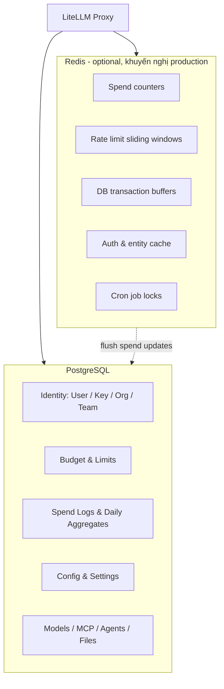
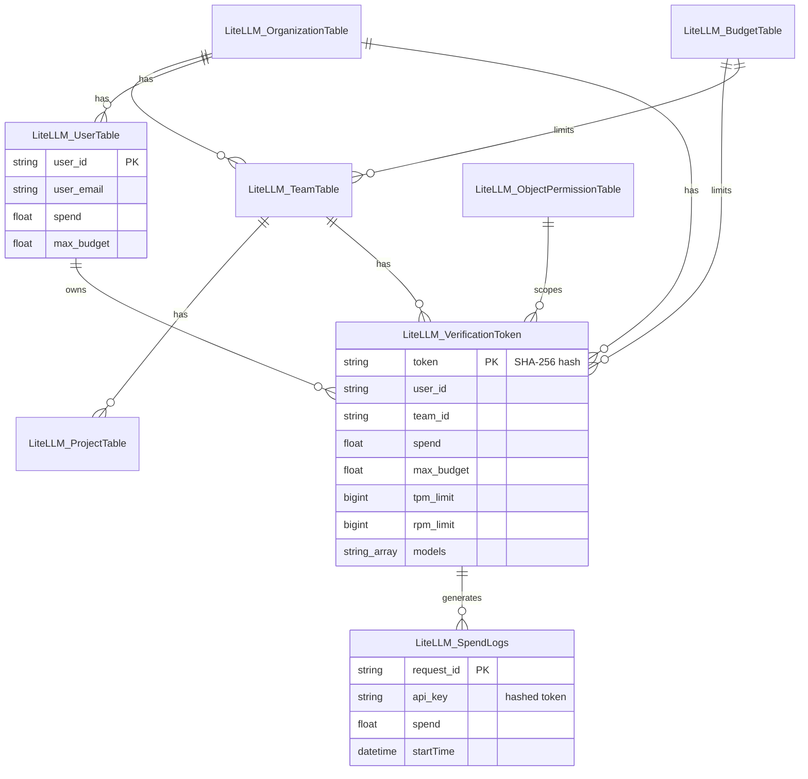
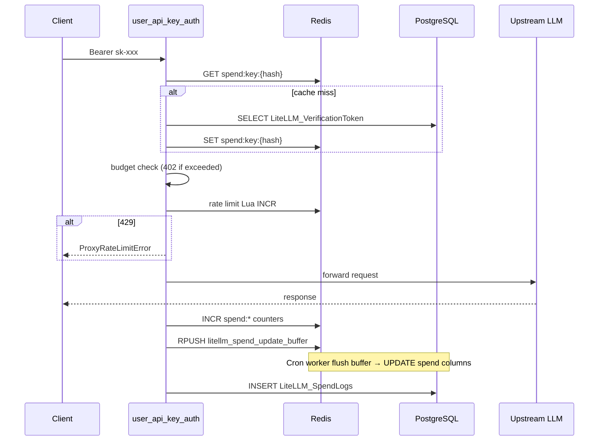

# Cấu trúc Database LiteLLM Proxy

Tài liệu mô tả schema PostgreSQL và cấu trúc dữ liệu Redis của LiteLLM Proxy trong repo này. Nguồn sự thật cho PostgreSQL là [`litellm/proxy/schema.prisma`](litellm/proxy/schema.prisma); migration nằm trong [`litellm-proxy-extras/litellm_proxy_extras/migrations/`](litellm-proxy-extras/litellm_proxy_extras/migrations/)

## Tổng quan

| Thành phần | Công nghệ | Vai trò |
|------------|-----------|---------|
| Database chính | PostgreSQL + Prisma (`prisma-client-py`) | Lưu trữ bền vững: user, virtual key, team, spend logs, config |
| Cache / coordination | Redis (`coordination_redis` hoặc `REDIS_*` env) | Spend counter realtime, rate limiting, buffer ghi DB, auth cache, distributed lock |
| Connection string | `DATABASE_URL` | Prisma datasource |

Redis **không bắt buộc** khi chạy single-instance dev, nhưng **cần thiết** khi deploy multi-instance để đồng bộ quota, rate limit và spend counter (xem [`giai-thich.md`](giai-thich.md) mục 6.5)

---

## PostgreSQL: Danh sách bảng

Tên bảng PostgreSQL trùng tên Prisma model (trừ khi có `@@map`). Tổng cộng **~55 bảng**, nhóm theo domain

### 1. Identity & Virtual Key

#### `LiteLLM_UserTable`

User nội bộ (admin / member proxy)

| Cột | Kiểu | Mô tả |
|-----|------|-------|
| `user_id` | String (PK) | ID user |
| `user_email`, `user_alias` | String? | Email, alias hiển thị |
| `sso_user_id` | String? (unique) | ID từ SSO |
| `password` | String? | Mật khẩu (nếu dùng local auth) |
| `user_role` | String? | `proxy_admin`, `internal_user`, ... |
| `team_id`, `teams[]` | String / String[] | Team mặc định và danh sách team |
| `organization_id` | String? (FK) | → `LiteLLM_OrganizationTable` |
| `object_permission_id` | String? (FK) | → `LiteLLM_ObjectPermissionTable` |
| `max_budget`, `spend` | Float | Budget và chi tiêu tích lũy |
| `models[]` | String[] | Model được phép |
| `tpm_limit`, `rpm_limit` | BigInt? | Rate limit cấp user |
| `max_parallel_requests` | Int? | Giới hạn request song song |
| `budget_duration`, `budget_reset_at` | String? / DateTime? | Chu kỳ reset budget |
| `model_spend`, `model_max_budget` | Json | Chi tiêu / budget theo model |
| `metadata`, `policies[]` | Json / String[] | Metadata tùy chỉnh, policy gắn kèm |
| `allowed_cache_controls[]` | String[] | Cache control được phép |
| `created_at`, `updated_at` | DateTime? | Timestamp |

#### `LiteLLM_VerificationToken` (alias logic: bảng `key`)

Virtual key mà client gửi qua `Authorization: Bearer sk-...`. **Token lưu dạng SHA-256 hash**, không lưu plaintext

| Cột | Kiểu | Mô tả |
|-----|------|-------|
| `token` | String (PK) | Hash SHA-256 của `sk-...` |
| `key_name`, `key_alias` | String? | Tên / alias key |
| `user_id`, `team_id`, `agent_id`, `project_id` | String? | Gắn key với entity |
| `organization_id` | String? (FK) | → Organization |
| `budget_id` | String? (FK) | → `LiteLLM_BudgetTable` |
| `object_permission_id` | String? (FK) | Quyền MCP / model / agent |
| `spend` | Float | Chi tiêu tích lũy (đồng bộ từ Redis) |
| `max_budget`, `budget_duration`, `budget_reset_at` | Float? / String? / DateTime? | Budget key |
| `tpm_limit`, `rpm_limit` | BigInt? | Rate limit key |
| `max_parallel_requests` | Int? | Request song song tối đa |
| `models[]` | String[] | Model alias được phép gọi |
| `model_spend`, `model_max_budget`, `budget_limits` | Json | Budget theo model |
| `budget_fallbacks` | Json | Fallback khi hết budget |
| `metadata`, `config`, `permissions`, `router_settings` | Json | Cấu hình mở rộng |
| `aliases` | Json | Model alias override |
| `allowed_routes[]`, `allowed_cache_controls[]` | String[] | Route / cache được phép |
| `key_type`, `policies[]`, `access_group_ids[]` | String / String[] | Loại key, policy, access group |
| `blocked`, `expires` | Boolean? / DateTime? | Block / hết hạn |
| `soft_budget_cooldown` | Boolean | Trạng thái cooldown budget alert |
| `auto_rotate`, `rotation_interval`, `rotation_count` | Boolean? / String? / Int? | Key rotation |
| `last_active`, `last_rotation_at`, `key_rotation_at` | DateTime? | Hoạt động / rotation |
| `created_at`, `updated_at`, `created_by`, `updated_by` | DateTime? / String? | Audit |

Index: `(user_id, team_id)`, `(team_id)`, `(budget_reset_at, expires)`

#### `LiteLLM_JWTKeyMapping`

Map JWT claim → virtual key (hashed)

| Cột | Kiểu | Mô tả |
|-----|------|-------|
| `id` | String (PK) | UUID |
| `jwt_claim_name`, `jwt_claim_value` | String | Claim cần match (vd. `sub`, `email`) |
| `token` | String (FK) | → `LiteLLM_VerificationToken.token` |
| `is_active` | Boolean | Bật / tắt mapping |

Unique: `(jwt_claim_name, jwt_claim_value)`

#### `LiteLLM_DeprecatedVerificationToken`

Key cũ trong grace period sau rotation; vẫn auth được đến `revoke_at`

| Cột | Kiểu | Mô tả |
|-----|------|-------|
| `id` | String (PK) | UUID |
| `token` | String (unique) | Hash key cũ |
| `active_token_id` | String | Hash key hiện tại |
| `revoke_at` | DateTime | Thời điểm key cũ ngừng hoạt động |

#### `LiteLLM_DeletedVerificationToken` / `LiteLLM_DeletedTeamTable`

Audit bảng đã xóa; giữ snapshot đầy đủ + metadata xóa (`deleted_at`, `deleted_by`, `deleted_by_api_key`)

#### `LiteLLM_EndUserTable`

End-user (customer của app dùng proxy), không phải user admin proxy

| Cột | Kiểu | Mô tả |
|-----|------|-------|
| `user_id` | String (PK) | ID end-user |
| `alias` | String? | Alias admin |
| `spend` | Float | Chi tiêu |
| `budget_id` | String? (FK) | → Budget |
| `object_permission_id` | String? (FK) | Quyền resource |
| `allowed_model_region`, `default_model` | String? | Ràng buộc region model |
| `blocked` | Boolean | Block |

#### `LiteLLM_InvitationLink`

Link mời user onboard

| Cột | Kiểu | Mô tả |
|-----|------|-------|
| `id` | String (PK) | UUID |
| `user_id` | String (FK) | User được mời |
| `is_accepted` | Boolean | Đã accept chưa |
| `expires_at`, `accepted_at` | DateTime | Hết hạn / accept |
| `created_by`, `updated_by` | String (FK) | → User |

---

### 2. Tổ chức: Organization, Team, Project

#### `LiteLLM_OrganizationTable`

| Cột | Kiểu | Mô tả |
|-----|------|-------|
| `organization_id` | String (PK) | UUID |
| `organization_alias` | String | Tên org |
| `budget_id` | String (FK) | → Budget |
| `models[]`, `spend`, `model_spend` | String[] / Float / Json | Model, chi tiêu |
| `metadata` | Json | Metadata |
| `object_permission_id` | String? (FK) | Quyền resource |

#### `LiteLLM_TeamTable`

| Cột | Kiểu | Mô tả |
|-----|------|-------|
| `team_id` | String (PK) | UUID |
| `team_alias` | String? | Tên team |
| `organization_id` | String? (FK) | → Organization |
| `admins[]`, `members[]` | String[] | User ID admin / member |
| `members_with_roles` | Json | Role per member |
| `max_budget`, `soft_budget`, `spend` | Float | Budget team |
| `models[]` | String[] | Model team được dùng |
| `tpm_limit`, `rpm_limit`, `max_parallel_requests` | BigInt? / Int? | Rate limit |
| `budget_duration`, `budget_reset_at` | String? / DateTime? | Reset budget |
| `model_spend`, `model_max_budget`, `budget_limits` | Json | Theo model |
| `router_settings` | Json? | Router config |
| `team_member_permissions[]` | String[] | Permission member |
| `access_group_ids[]`, `policies[]` | String[] | Access group, policy |
| `default_team_member_models[]` | String[] | Model mặc định cho member mới |
| `model_id` | Int? (FK, unique) | → `LiteLLM_ModelTable` (alias) |
| `allow_team_guardrail_config` | Boolean | Team admin config guardrail |
| `blocked` | Boolean | Block team |
| `metadata` | Json | Metadata |

Index: `organization_id`, `team_alias`, `created_at`

#### `LiteLLM_ProjectTable`

Project nằm giữa team và key (quản lý use-case)

| Cột | Kiểu | Mô tả |
|-----|------|-------|
| `project_id` | String (PK) | UUID |
| `project_alias`, `description` | String? | Tên, mô tả |
| `team_id` | String? (FK) | → Team |
| `budget_id` | String? (FK) | → Budget |
| `models[]`, `spend`, `model_spend` | String[] / Float / Json | Model, chi tiêu |
| `model_rpm_limit`, `model_tpm_limit` | Json | Limit theo model |
| `blocked` | Boolean | Block |
| `object_permission_id` | String? (FK) | Quyền |

#### `LiteLLM_TeamMembership` (composite PK: `user_id` + `team_id`)

Spend và budget của user **trong** một team cụ thể

| Cột | Kiểu | Mô tả |
|-----|------|-------|
| `user_id`, `team_id` | String (PK) | Composite key |
| `spend`, `total_spend` | Float | Chi tiêu trong team |
| `budget_id` | String? (FK) | Budget riêng cho membership |

#### `LiteLLM_OrganizationMembership` (composite PK: `user_id` + `organization_id`)

| Cột | Kiểu | Mô tả |
|-----|------|-------|
| `user_id`, `organization_id` | String (PK) | Composite key |
| `user_role` | String? | Role trong org |
| `spend` | Float? | Chi tiêu |
| `budget_id` | String? (FK) | Budget membership |

#### `LiteLLM_ModelTable`

Model alias cấp team

| Cột | Kiểu | Mô tả |
|-----|------|-------|
| `id` | Int (PK, autoincrement) | ID |
| `model_aliases` | Json? | Map alias → upstream model |

#### `LiteLLM_TagTable` (`tag_name` PK)

Tag có budget riêng; gắn vào request qua metadata

| Cột | Kiểu | Mô tả |
|-----|------|-------|
| `tag_name` | String (PK) | Tên tag |
| `description`, `models[]` | String? / String[] | Mô tả, model |
| `model_info` | Json? | Map model_id → name |
| `spend` | Float | Chi tiêu |
| `budget_id` | String? (FK) | → Budget |

---

### 3. Budget

#### `LiteLLM_BudgetTable`

Budget template dùng chung cho org, project, key, end-user, tag, membership

| Cột | Kiểu | Mô tả |
|-----|------|-------|
| `budget_id` | String (PK) | UUID |
| `max_budget`, `soft_budget` | Float? | Budget cứng / mềm |
| `max_parallel_requests` | Int? | Parallel requests |
| `tpm_limit`, `rpm_limit` | BigInt? | Rate limit |
| `model_max_budget` | Json? | Budget theo model |
| `budget_duration`, `budget_reset_at` | String? / DateTime? | Chu kỳ reset |
| `allowed_models[]` | String[] | Model scope (empty = inherit) |
| `created_by`, `updated_by` | String | Audit |

Quan hệ: một budget có thể gắn nhiều org, project, key, end-user, tag, team membership, org membership

---

### 4. Quyền truy cập resource

#### `LiteLLM_ObjectPermissionTable`

Quyền MCP, vector store, agent, model, tool cho key / team / user / org

| Cột | Kiểu | Mô tả |
|-----|------|-------|
| `object_permission_id` | String (PK) | UUID |
| `mcp_servers[]`, `mcp_access_groups[]` | String[] | MCP server / group |
| `mcp_tool_permissions` | Json? | Tool-level: `{"server_id": ["tool1"]}` |
| `mcp_toolsets[]`, `search_tools[]` | String[] | Toolset, search tool |
| `vector_stores[]`, `agents[]`, `agent_access_groups[]` | String[] | Vector store, agent |
| `models[]`, `blocked_tools[]` | String[] | Model, tool bị block |
| `mcp_tool_search_enabled` | Boolean? | Bật MCP tool search |

#### `LiteLLM_AccessGroupTable`

Nhóm truy cập thống nhất (model + MCP + agent)

| Cột | Kiểu | Mô tả |
|-----|------|-------|
| `access_group_id` | String (PK) | UUID |
| `access_group_name` | String (unique) | Tên group |
| `access_model_names[]`, `access_mcp_server_ids[]`, `access_agent_ids[]` | String[] | Resource trong group |
| `assigned_team_ids[]`, `assigned_key_ids[]` | String[] | Team / key được gán |

---

### 5. Model, Credential, Agent

#### `LiteLLM_ProxyModelTable`

Model đăng ký trên proxy (từ DB hoặc config YAML)

| Cột | Kiểu | Mô tả |
|-----|------|-------|
| `model_id` | String (PK) | UUID |
| `model_name` | String | Alias client gọi |
| `litellm_params` | Json | `model`, `api_key`, `aws_region_name`, ... |
| `model_info` | Json? | Metadata model |
| `blocked` | Boolean | Block model |

#### `LiteLLM_CredentialsTable`

Credential provider (API key upstream) lưu an toàn

| Cột | Kiểu | Mô tả |
|-----|------|-------|
| `credential_id` | String (PK) | UUID |
| `credential_name` | String (unique) | Tên credential |
| `credential_values`, `credential_info` | Json / Json? | Giá trị (encrypted) và metadata |

#### `LiteLLM_AgentsTable`

Agent (A2A / agent card)

| Cột | Kiểu | Mô tả |
|-----|------|-------|
| `agent_id` | String (PK) | UUID |
| `agent_name` | String (unique) | Tên agent |
| `litellm_params`, `agent_card_params` | Json | Config agent |
| `static_headers`, `extra_headers[]` | Json / String[] | Headers |
| `agent_access_groups[]` | String[] | Access group |
| `object_permission_id` | String? (FK) | Quyền |
| `spend`, `tpm_limit`, `rpm_limit` | Float / Int? | Chi tiêu, limit |
| `session_tpm_limit`, `session_rpm_limit` | Int? | Limit theo session |

---

### 6. MCP

#### `LiteLLM_MCPServerTable`

| Cột | Kiểu | Mô tả |
|-----|------|-------|
| `server_id` | String (PK) | UUID |
| `server_name`, `alias`, `description` | String? | Tên, alias |
| `url`, `transport`, `auth_type` | String? | SSE/stdio, OAuth, ... |
| `credentials`, `mcp_info` | Json | Credential, info |
| `mcp_access_groups[]`, `allowed_tools[]` | String[] | Group, tool |
| `command`, `args[]`, `env` | String / String[] / Json | Stdio transport |
| `oauth2_flow`, `token_url`, `authorization_url`, ... | String? | OAuth config |
| `allow_all_keys`, `available_on_public_internet` | Boolean | Public / all keys |
| `is_byok`, `approval_status` | Boolean / String? | BYOK, lifecycle |
| `status`, `last_health_check` | String? / DateTime? | Health check |

#### `LiteLLM_MCPToolsetTable`

Collection `{server_id, tool_name}` grant cho key/team

#### `LiteLLM_MCPUserCredentials` / `LiteLLM_MCPUserEnvVars`

BYOK credential và env vars per-user per-server (unique: `user_id` + `server_id`)

---

### 7. Spend & Logging

#### `LiteLLM_SpendLogs`

Log từng request LLM (có thể partition theo `startTime` ở production high-volume)

| Cột | Kiểu | Mô tả |
|-----|------|-------|
| `request_id` | String (PK) | ID request |
| `call_type` | String | `acompletion`, `aembedding`, ... |
| `api_key` | String | **Hash** virtual key (không phải `sk-...`) |
| `spend` | Float | Chi phí USD |
| `total_tokens`, `prompt_tokens`, `completion_tokens` | Int | Token usage |
| `startTime`, `endTime` | DateTime | Thời gian |
| `request_duration_ms` | Int? | Duration |
| `model`, `model_id`, `model_group` | String / String? | Model upstream / alias |
| `custom_llm_provider`, `api_base` | String? | Provider, base URL |
| `user`, `team_id`, `organization_id`, `end_user` | String? | Entity scope |
| `metadata` | Json? | `project_id`, custom fields |
| `cache_hit`, `cache_key` | String? | Cache |
| `request_tags` | Json? | Tags |
| `messages`, `response` | Json? | Payload (có thể truncate) |
| `session_id`, `agent_id` | String? | Session / agent |
| `status` | String? | Success / error |
| `mcp_namespaced_tool_name` | String? | MCP tool |
| `proxy_server_request` | Json? | Raw proxy request |
| `requester_ip_address` | String? | IP client |

Index: `startTime`, `(startTime, request_id)`, `end_user`, `session_id`

#### `LiteLLM_ErrorLogs`

Log lỗi request (không có spend)

| Cột | Kiểu | Mô tả |
|-----|------|-------|
| `request_id` | String (PK) | UUID |
| `startTime`, `endTime` | DateTime | Thời gian |
| `model_group`, `litellm_model_name`, `model_id` | String | Model info |
| `request_kwargs` | Json | Request params |
| `exception_type`, `exception_string`, `status_code` | String | Lỗi |

#### Bảng daily aggregate (pattern chung)

Các bảng sau có cấu trúc tương tự; khác ở dimension key và unique constraint:

| Bảng | Dimension | Unique key |
|------|-----------|------------|
| `LiteLLM_DailyUserSpend` | `user_id` | `(user_id, date, api_key, model, custom_llm_provider, mcp_namespaced_tool_name, endpoint)` |
| `LiteLLM_DailyTeamSpend` | `team_id` | `(team_id, date, ...)` |
| `LiteLLM_DailyOrganizationSpend` | `organization_id` | `(organization_id, date, ...)` |
| `LiteLLM_DailyEndUserSpend` | `end_user_id` | `(end_user_id, date, ...)` |
| `LiteLLM_DailyAgentSpend` | `agent_id` | `(agent_id, date, ...)` |
| `LiteLLM_DailyTagSpend` | `tag` | `(tag, date, ...)` |

Cột chung: `date` (YYYY-MM-DD), `api_key`, `model`, `model_group`, `custom_llm_provider`, `endpoint`, `prompt_tokens`, `completion_tokens`, `cache_read_input_tokens`, `cache_creation_input_tokens`, `spend`, `api_requests`, `successful_requests`, `failed_requests`

#### `LiteLLM_DailyGuardrailMetrics` / `LiteLLM_DailyPolicyMetrics`

Metrics dashboard guardrail / policy theo ngày (composite PK: `guardrail_id`+`date` hoặc `policy_id`+`date`)

#### `LiteLLM_SpendLogGuardrailIndex` / `LiteLLM_SpendLogToolIndex`

Index phụ để query nhanh log theo guardrail / tool

---

### 8. Guardrail, Policy, Tool

#### `LiteLLM_GuardrailsTable`

| Cột | Kiểu | Mô tả |
|-----|------|-------|
| `guardrail_id` | String (PK) | UUID |
| `guardrail_name` | String (unique) | Tên |
| `litellm_params`, `guardrail_info` | Json | Config |
| `team_id` | String? | Team-owned guardrail |
| `status` | String | `active`, `pending_review`, `rejected` |

#### `LiteLLM_PolicyTable` (versioned)

| Cột | Kiểu | Mô tả |
|-----|------|-------|
| `policy_id` | String (PK) | UUID |
| `policy_name`, `version_number` | String / Int | Unique: `(policy_name, version_number)` |
| `version_status` | String | `draft`, `published`, `production` |
| `inherit`, `condition`, `pipeline` | String? / Json | Policy logic |
| `guardrails_add[]`, `guardrails_remove[]` | String[] | Guardrail delta |

#### `LiteLLM_PolicyAttachmentTable`

Gắn policy vào scope (`teams[]`, `keys[]`, `models[]`, `tags[]`)

#### `LiteLLM_ToolTable`

Tool registry auto-discovered từ LLM response

| Cột | Kiểu | Mô tả |
|-----|------|-------|
| `tool_id` | String (PK) | UUID |
| `tool_name` | String (unique) | Tên tool (vd. MCP namespaced) |
| `origin` | String? | MCP server hoặc `user_defined` |
| `input_policy`, `output_policy` | String | `trusted` / `untrusted` / `blocked` |
| `call_count` | Int | Số lần gọi |
| `team_id`, `key_hash`, `key_alias` | String? | Entity discover tool |
| `last_used_at` | DateTime? | Lần gọi gần nhất |

---

### 9. Managed Resources

| Bảng | Mục đích |
|------|----------|
| `LiteLLM_ManagedFileTable` | File OpenAI unified ID; `unified_file_id`, `file_object`, `model_mappings`, `storage_backend` |
| `LiteLLM_ManagedObjectTable` | Batch / fine-tune job objects |
| `LiteLLM_ManagedVectorStoreTable` | Vector store unified resource |
| `LiteLLM_ManagedVectorStoresTable` | Vector store per provider |
| `LiteLLM_ManagedVectorStoreIndexTable` | Vector store index config |

---

### 10. Config & Settings

| Bảng | PK | Mục đích |
|------|-----|----------|
| `LiteLLM_Config` | `param_name` | Lưu `config.yaml` (vd. `param_name=general_settings`) |
| `LiteLLM_ConfigOverrides` | `config_type` | Override config theo loại |
| `LiteLLM_CacheConfig` | `id=cache_config` | Redis cache settings |
| `LiteLLM_SSOConfig` | `id=sso_config` | SSO settings |
| `LiteLLM_UISettings` | `id=ui_settings` | UI dashboard settings |

#### Khác

| Bảng | Mục đích |
|------|----------|
| `LiteLLM_PromptTable` | Prompt template versioned (`prompt_id`, `version`, `environment`) |
| `LiteLLM_SearchToolsTable` | Search tool config |
| `LiteLLM_SkillsTable` | LiteLLM-managed skills (SKILL.md, zip binary) |
| `LiteLLM_HealthCheckTable` | Kết quả health check model |
| `LiteLLM_UserNotifications` | User request access model (`status`: approved/disapproved/pending) |
| `LiteLLM_AuditLog` | Audit CRUD (`action`, `table_name`, `object_id`, `before_value`, `updated_values`) |
| `LiteLLM_CronJob` | Leader election cron job (`pod_id`, `status`, `ttl`) |
| `LiteLLM_ClaudeCodePluginTable` | Claude Code plugin marketplace |
| `LiteLLM_MemoryTable` | Memory store (`key` global unique, `value`, `user_id`, `team_id`) |
| `LiteLLM_AdaptiveRouterState` | Beta posterior adaptive router |
| `LiteLLM_AdaptiveRouterSession` | Session signal counters adaptive router |
| `LiteLLM_WorkflowRun` | Workflow run header (`session_id` unique, `workflow_type`, `status`) |
| `LiteLLM_WorkflowEvent` | Append-only state transitions |
| `LiteLLM_WorkflowMessage` | Conversation inbox/outbox full content |

---

## Sơ đồ quan hệ chính (virtual key flow)

---

## Redis: Cấu trúc key

Redis dùng qua `coordination_redis` (config) hoặc biến môi trường `REDIS_HOST`, `REDIS_PORT`, ... Có thể có `namespace` prefix tùy config cache

### 1. Spend counters (budget enforcement)

Đọc Redis-first, fallback DB. Cập nhật sau mỗi request qua `update_spend()` trong [`litellm/proxy/proxy_server.py`](litellm/proxy/proxy_server.py)

| Key pattern | Kiểu | Map DB | Mô tả |
|-------------|------|--------|-------|
| `spend:key:{hashed_token}` | Float (INCR) | `LiteLLM_VerificationToken.spend` | Chi tiêu virtual key |
| `spend:key:{hashed_token}:window:{duration}` | Float | Budget window key | Budget theo chu kỳ (vd. `30d`) |
| `spend:user:{user_id}` | Float | `LiteLLM_UserTable.spend` | Chi tiêu user |
| `spend:team:{team_id}` | Float | `LiteLLM_TeamTable.spend` | Chi tiêu team |
| `spend:team:{team_id}:window:{duration}` | Float | Team budget window | Budget team theo chu kỳ |
| `spend:team_member:{user_id}:{team_id}` | Float | `LiteLLM_TeamMembership.spend` | Chi tiêu user trong team |
| `spend:org:{org_id}` | Float | `LiteLLM_OrganizationTable.spend` | Chi tiêu organization |
| `spend:end_user:{end_user_id}` | Float | `LiteLLM_EndUserTable.spend` | Chi tiêu end-user |
| `spend:tag:{tag_name}` | Float | `LiteLLM_TagTable.spend` | Chi tiêu tag |
| `spend_db_floor:{counter_key}` | Marker | — | Đánh dấu đã reseed counter từ DB |
| `virtual_key_spend:{hash}:{model}:{duration}` | Float | `model_spend` JSON | Budget theo model (key) |
| `end_user_model_spend:{end_user_id}:{model}:{duration}` | Float | — | Budget theo model (end-user) |

Budget reservation (tránh race condition trước khi gọi LLM) tạm thời increment các counter trên; reconcile sau request trong [`budget_reservation.py`](litellm/proxy/spend_tracking/budget_reservation.py)

### 2. Rate limiting (sliding window 60s)

Hook `parallel_request_limiter_v3` dùng Lua script atomic. Window size mặc định 60 giây

| Key pattern | Kiểu | Mô tả |
|-------------|------|-------|
| `{descriptor_key:descriptor_value}:window` | String (timestamp) | Thời điểm bắt đầu window |
| `{descriptor_key:descriptor_value}:requests` | Int (INCR) | Số request trong window (RPM) |
| `{descriptor_key:descriptor_value}:tokens` | Int (INCR) | Token trong window (TPM) |
| `{descriptor_key:descriptor_value}:max_parallel_requests` | Int (INCR) | Request song song |

`descriptor_key` và `descriptor_value` theo scope:

| descriptor_key | descriptor_value ví dụ | Limit fields |
|----------------|------------------------|--------------|
| `api_key` | `{hashed_token}` | `rpm_limit`, `tpm_limit`, `max_parallel_requests` |
| `user` | `{user_id}` | `user_rpm_limit`, `user_tpm_limit` |
| `team` | `{team_id}` | `team_rpm_limit`, `team_tpm_limit` |
| `team_member` | `{team_id}:{user_id}` | `team_member_rpm/tpm_limit` |
| `end_user` | `{end_user_id}` | `end_user_rpm/tpm_limit` |
| `organization` | `{org_id}` | `organization_rpm/tpm_limit` |
| `model_per_key` | `{hashed_token}:{model}` | Model-specific limit trên key |
| `model_per_team` | `{team_id}:{model}` | Model-specific limit trên team |
| `model_per_organization` | `{org_id}:{model}` | Model-specific limit trên org |
| `model_per_project` | `{project_id}:{model}` | Model-specific limit trên project |
| `tag_per_key` | `{hashed_token}:{tag}` | RPM theo tag trên key |
| `mcp_per_key` | `{hashed_token}:{mcp_server}` | MCP RPM per key |
| `mcp_per_team` | `{team_id}:{mcp_server}` | MCP RPM per team |
| `agent` | `{agent_id}` | Agent RPM/TPM |
| `agent_session` | `{agent_id}:{session_id}` | Agent session limits |

Dấu `{}` trong key là Redis hash tag (cluster-safe grouping)

### 3. DB transaction buffers (Redis lists)

Khi `use_redis_transaction_buffer: true`, spend UPDATE được buffer trước khi flush vào PostgreSQL ([`redis_update_buffer.py`](litellm/proxy/db/db_transaction_queue/redis_update_buffer.py))

| Redis key (constant) | Nội dung queue |
|----------------------|----------------|
| `litellm_spend_update_buffer` | `REDIS_UPDATE_BUFFER_KEY` — entity spend updates |
| `litellm_daily_spend_update_buffer` | Daily user spend |
| `litellm_daily_team_spend_update_buffer` | Daily team spend |
| `litellm_daily_org_spend_update_buffer` | Daily org spend |
| `litellm_daily_end_user_spend_update_buffer` | Daily end-user spend |
| `litellm_daily_agent_spend_update_buffer` | Daily agent spend |
| `litellm_daily_tag_spend_update_buffer` | Daily tag spend |

Mỗi entry là JSON serialized transaction; worker dequeue bằng `LPOP` / pipeline

### 4. Distributed locks (cron jobs)

| Key pattern | Kiểu | Mô tả |
|-------------|------|-------|
| `cronjob_lock:{cronjob_id}` | String (SET NX EX) | Lock per cron job; value = `pod_id` |

Dùng bởi `PodLockManager` để đảm bảo chỉ một pod chạy job (spend flush, key rotation, budget reset, ...)

Bảng `LiteLLM_CronJob` trong PostgreSQL cũng track leader (`pod_id`, `status`, `ttl`) khi không dùng Redis lock

### 5. Auth & entity cache

Cache qua `UserApiKeyCache` (DualCache: in-memory + Redis). Key chính là **hashed token**

| Key pattern | Mô tả |
|-------------|-------|
| `{hashed_token}` | `UserAPIKeyAuth` object sau auth |
| `jwt_key_mapping:{claim_name}:{claim_value}` | JWT → virtual key mapping |
| `team_alias:{alias}` | Resolve team alias → team object |
| `team_id:{team_id}` | Team by ID |
| `team_id:{team_id}` (composite `{team_id}_{user_id}`) | Team membership cache |
| `org_alias:{alias}` | Organization by alias |
| `org_id:{org_id}` | Organization by ID |
| `org_id:{org_id}:with_budget` | Org kèm budget |
| `project_id:{project_id}` | Project |
| `tag:{tag_name}` | Tag object |
| `end_user_validation:{raw_end_user_id}` | End-user validation |
| `team_member_default_budget:{budget_id}` | Default budget team member |
| `default_end_user_budget:{budget_id}` | Default end-user budget |
| `{admin_name}:spend` | Spend counter master/admin key |
| `ui_settings:settings_dict` | UI settings cache (TTL) |
| `litellm_config:{param_name}` | Config param cache |
| `litellm_oidc_discovery_{url}` | OIDC discovery document |
| `litellm_jwt_auth_keys_{jwks_url}` | JWKS keys |
| `oidc_userinfo_{token_hash}` | OIDC userinfo |
| `cli_sso_session:flow:{login_id}` | CLI SSO flow state |
| `cli_sso_session:flow:start_rate_limit:{ip_hash}` | SSO start rate limit |

### 6. LLM response cache (tùy config)

Khi bật `cache: type: redis` trong config, LiteLLM cache response LLM qua [`litellm/caching/`](litellm/caching/). Key derive từ model + messages hash (namespace có thể prefix qua `RedisCache.namespace`)

Đây là cache **response LLM**, tách biệt với coordination Redis dùng cho spend/rate-limit

---

## Luồng dữ liệu quota (DB + Redis)

---

## Ghi chú quan trọng

**Token hashing.** Virtual key `sk-...` được hash SHA-256 trước khi lưu DB và dùng làm Redis key. Plaintext chỉ trả về một lần lúc tạo key (`/key/generate`, `/user/new`)

**Bảng `key` vs model name.** Code thường dùng alias `table_name="key"` map tới `LiteLLM_VerificationToken`

**SpendLogs partitioning.** Mặc định không partition. Production high-volume có thể chạy [`db_scripts/partition_spend_logs.sql`](db_scripts/partition_spend_logs.sql) và bật `use_spend_logs_partitioning`

**Hai Redis logic.** (1) `coordination_redis` / env Redis cho spend, rate limit, locks; (2) `cache` config cho LLM response cache. Có thể trỏ cùng hoặc khác instance

**Nguồn schema.** Khi cần chi tiết cột đầy đủ, đọc trực tiếp [`litellm/proxy/schema.prisma`](litellm/proxy/schema.prisma); file này là bản tóm tắt có cấu trúc phục vụ hiểu kiến trúc quota/virtual key trong [`giai-thich.md`](giai-thich.md)
