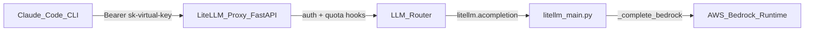
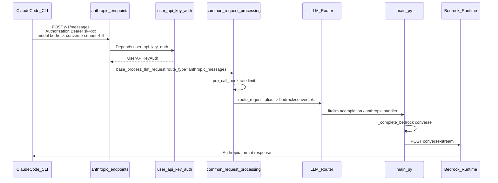
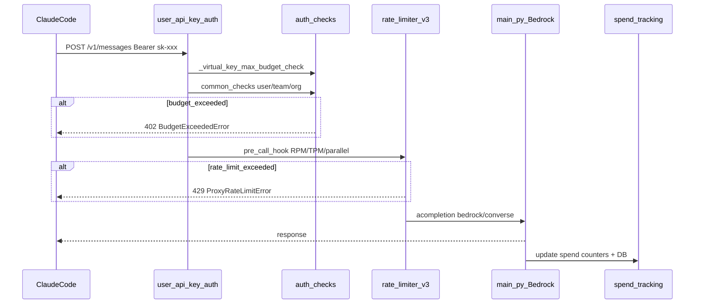

# Giải thích kiến trúc LiteLLM: Bedrock, Claude Code, Virtual Key và Quota

Tài liệu này mô tả cách LiteLLM trong repo này hoạt động như một gateway LLM: nhận request từ client (đặc biệt là Claude Code), xác thực virtual key, kiểm tra quota, rồi gọi upstream AWS Bedrock. Điểm bắt đầu của luồng core SDK là [`litellm/main.py`](litellm/main.py); điểm bắt đầu của luồng HTTP server là [`litellm/proxy/`](litellm/proxy/)

## 1. Tổng quan kiến trúc

LiteLLM chia làm hai tầng chính. Tầng **proxy** (`litellm/proxy/`) là FastAPI server lắng nghe HTTP, xác thực key, quản lý user, và enforce quota. Tầng **core SDK** (`litellm/main.py` cùng `litellm/llms/bedrock/`) nhận lệnh gọi nội bộ từ proxy, resolve provider, transform request/response, rồi gọi API upstream



Khi admin chạy proxy local, lệnh thường dùng là:

```bash
python litellm/proxy/proxy_cli.py --config litellm/proxy/dev_config.yaml --detailed_debug --reload
```

Proxy lắng nghe mặc định tại `http://localhost:4000`. File config [`litellm/proxy/dev_config.yaml`](litellm/proxy/dev_config.yaml) khai báo `model_list` (alias model -> upstream provider) và `general_settings.master_key` (key admin dùng cho các endpoint quản trị)

## 2. Luồng gọi AWS Bedrock (từ `main.py`)

### 2.1 Entry point

Hàm public chính là `completion()` và `acompletion()` trong [`litellm/main.py`](litellm/main.py). Proxy gọi `acompletion` qua `route_type="acompletion"`; Claude Code gọi qua `route_type="anthropic_messages"`, nhưng cả hai đều dẫn về cùng core dispatch

Trong `completion()`, LiteLLM thực hiện các bước: validate input, gọi `get_llm_provider()` để xác định `custom_llm_provider`, map params qua `get_optional_params()`, rồi dispatch theo provider. Khi `custom_llm_provider == "bedrock"`, code rẽ vào `_complete_bedrock()`:

```5600:5602:litellm/main.py
        elif custom_llm_provider == "bedrock":
            # boto3 reads keys from .env
            response = _complete_bedrock(_dispatch_ctx)
```

### 2.2 Chọn provider và route Bedrock

`get_llm_provider()` (trong [`litellm/litellm_core_utils/get_llm_provider_logic.py`](litellm/litellm_core_utils/get_llm_provider_logic.py)) chọn `custom_llm_provider="bedrock"` khi model string có prefix `bedrock/`, hoặc model nằm trong danh sách Bedrock đã load từ `model_prices_and_context_window.json`

Sau khi vào `_complete_bedrock()`, LiteLLM chọn **nhánh API Bedrock** qua `BedrockModelInfo.get_bedrock_route(model)` trong [`litellm/llms/bedrock/common_utils.py`](litellm/llms/bedrock/common_utils.py):

```3871:3915:litellm/main.py
    bedrock_route = BedrockModelInfo.get_bedrock_route(model)
    if bedrock_route == "claude_platform":
        ...
    elif bedrock_route == "converse":
        model = model.replace("converse/", "")
        response = bedrock_converse_chat_completion.completion(
            model=model,
            messages=messages,
            ...
        )
```

Ba nhánh phổ biến cho Claude trên Bedrock:

| Route | Endpoint AWS | Khi nào dùng |
|-------|-------------|--------------|
| `converse` | `POST /model/{id}/converse` hoặc `/converse-stream` | Mặc định cho Claude 3+/4+, Nova; prefix `bedrock/converse/` hoặc auto-detect |
| `invoke` | `POST /model/{id}/invoke` | Legacy/fallback; prefix `bedrock/invoke/` hoặc model không thuộc converse |
| `claude_platform` | Anthropic Messages API qua AWS gateway | Prefix `bedrock/claude_platform/` |

### 2.3 Thực thi HTTP call (nhánh Converse)

Singleton `bedrock_converse_chat_completion = BedrockConverseLLM()` được khởi tạo ở đầu `main.py`. Class `BedrockConverseLLM` trong [`litellm/llms/bedrock/chat/converse_handler.py`](litellm/llms/bedrock/chat/converse_handler.py) thực hiện:

1. Resolve AWS region từ `optional_params` hoặc model path
2. Lấy credentials qua `BaseAWSLLM.get_credentials()` (access key, AssumeRole, profile, env vars)
3. Build URL runtime endpoint
4. Transform messages OpenAI/Anthropic sang Bedrock Converse body qua `AmazonConverseConfig._transform_request()`
5. Ký request SigV4 (hoặc Bearer nếu có `AWS_BEARER_TOKEN_BEDROCK`)
6. POST bằng httpx

Đoạn build URL:

```337:348:litellm/llms/bedrock/chat/converse_handler.py
        endpoint_url, proxy_endpoint_url = self.get_runtime_endpoint(
            api_base=api_base,
            aws_bedrock_runtime_endpoint=aws_bedrock_runtime_endpoint,
            aws_region_name=aws_region_name,
        )
        if (stream is not None and stream is True) and not fake_stream:
            endpoint_url = f"{endpoint_url}/model/{modelId}/converse-stream"
            ...
        else:
            endpoint_url = f"{endpoint_url}/model/{modelId}/converse"
```

Auth và signing dùng chung từ [`litellm/llms/bedrock/base_aws_llm.py`](litellm/llms/bedrock/base_aws_llm.py): `get_credentials()`, `get_runtime_endpoint()` trả về `https://bedrock-runtime.{region}.amazonaws.com`, `get_request_headers()` ký SigV4 với service `bedrock`

Nhánh **invoke** đi qua `BaseLLMHTTPHandler.completion()` trong [`litellm/llms/custom_httpx/llm_http_handler.py`](litellm/llms/custom_httpx/llm_http_handler.py), với transform per-model trong thư mục `litellm/llms/bedrock/chat/invoke_transformations/`

### 2.4 Cấu hình model Bedrock trên proxy

Trong [`litellm/proxy/dev_config.yaml`](litellm/proxy/dev_config.yaml), mỗi entry `model_list` map alias (tên client gọi) sang upstream model ID:

```yaml
  - model_name: bedrock-converse-sonnet-4-6
    litellm_params:
      model: bedrock/converse/us.anthropic.claude-sonnet-4-6
      aws_region_name: us-east-1
```

Client chỉ cần gửi `"model": "bedrock-converse-sonnet-4-6"`; proxy Router resolve alias này thành `bedrock/converse/us.anthropic.claude-sonnet-4-6` rồi gọi `_complete_bedrock()`. AWS credentials lấy từ env (`AWS_ACCESS_KEY_ID`, `AWS_SECRET_ACCESS_KEY`, `AWS_REGION_NAME`) hoặc IAM role của host chạy proxy

## 3. Cơ chế cung cấp API cho Claude Code

Claude Code CLI/SDK gọi **Anthropic Messages API** (`POST /v1/messages`), không phải OpenAI `/v1/chat/completions`. LiteLLM proxy expose endpoint này tại [`litellm/proxy/anthropic_endpoints/endpoints.py`](litellm/proxy/anthropic_endpoints/endpoints.py):

```64:99:litellm/proxy/anthropic_endpoints/endpoints.py
@router.post(
    "/v1/messages",
    tags=["[beta] Anthropic `/v1/messages`"],
    dependencies=[Depends(user_api_key_auth)],
)
async def anthropic_response(
    ...
):
    ...
        result = await base_llm_response_processor.base_process_llm_request(
            ...
            route_type="anthropic_messages",
            ...
        )
```

Endpoint được lazy-load qua [`litellm/proxy/_lazy_features.py`](litellm/proxy/_lazy_features.py) khi request khớp prefix `/v1/messages`, `/anthropic`, hoặc `/claude-code`. Ngoài ra proxy còn có `/v1/chat/completions` (OpenAI format) tại [`litellm/proxy/proxy_server.py`](litellm/proxy/proxy_server.py) dòng 8682, nhưng Claude Code dùng `/v1/messages`

### Luồng request Claude Code -> Bedrock



Repo có bằng chứng tích hợp thực tế trong [`tests/e2e/claude_code/basic_messaging_non_streaming/test_bedrock_converse.py`](tests/e2e/claude_code/basic_messaging_non_streaming/test_bedrock_converse.py): test chạy CLI `claude` thật qua proxy, gửi model alias Bedrock Converse, và assert response

### Cấu hình Claude Code trỏ về LiteLLM proxy

User cấu hình Claude Code trỏ base URL về proxy thay vì `api.anthropic.com`:

```bash
export ANTHROPIC_BASE_URL=http://localhost:4000
export ANTHROPIC_API_KEY=sk-{virtual_key_do_admin_cap}
```

Claude Code gửi `Authorization: Bearer sk-...` kèm model alias đã đăng ký trong `model_list` của proxy. Proxy xử lý auth, quota, routing; Claude Code không cần biết upstream là Bedrock hay Anthropic native

## 4. Cơ chế virtual key theo user

### 4.1 Data model

Schema Prisma tại [`litellm/proxy/schema.prisma`](litellm/proxy/schema.prisma) định nghĩa hai bảng chính:

**`LiteLLM_VerificationToken`** (bảng `key`): lưu virtual key đã hash, gắn với `user_id`, `team_id`, danh sách `models[]` được phép, và các limit (`max_budget`, `tpm_limit`, `rpm_limit`, `max_parallel_requests`, `model_max_budget`, `budget_limits`, ...)

**`LiteLLM_UserTable`** (bảng `user`): identity user (`user_email`, `user_id`) cùng budget/rate limits cấp ở cấp user

### 4.2 Tạo key

Hai endpoint quản trị chính:

`POST /key/generate` trong [`litellm/proxy/management_endpoints/key_management_endpoints.py`](litellm/proxy/management_endpoints/key_management_endpoints.py): admin tạo key cho user cụ thể, truyền `user_id`, `models`, `max_budget`, `tpm_limit`, `rpm_limit`, ...

`POST /user/new` trong [`litellm/proxy/management_endpoints/internal_user_endpoints.py`](litellm/proxy/management_endpoints/internal_user_endpoints.py): tạo user mới và auto-create key (`auto_create_key=True` mặc định)

Cả hai đều gọi `generate_key_helper_fn()` (~dòng 3522). Hàm này sinh token nếu caller không truyền:

```3587:3591:litellm/proxy/management_endpoints/key_management_endpoints.py
    if token is None:
        if key is not None:
            token = key
        else:
            token = f"sk-{secrets.token_urlsafe(LENGTH_OF_LITELLM_GENERATED_KEY)}"
```

Token plaintext chỉ trả về **một lần** lúc tạo. Khi ghi DB, token được hash SHA-256 qua `hash_token()` trước khi insert vào bảng `key` (dòng ~3782: `{**key_data, "token": hash_token(token=token)}`). Điều này ngăn lộ key nếu DB bị dump

### 4.3 Auth mỗi request

[`litellm/proxy/auth/user_api_key_auth.py`](litellm/proxy/auth/user_api_key_auth.py) là dependency FastAPI gắn vào mọi endpoint LLM. Luồng:

1. Đọc key từ header theo thứ tự ưu tiên: `X-LiteLLM-Key`, `Authorization: Bearer sk-...`, `x-api-key`
2. Validate format: virtual key phải bắt đầu bằng `sk-`
3. `hash_token(sk-xxx)` rồi lookup trong DB/cache (`IdentityStore`, `UserApiKeyCache`)
4. Trả object `UserAPIKeyAuth` chứa `user_id`, `max_budget`, `tpm_limit`, `rpm_limit`, `models`, team/org context

**Gán key cho user:** admin gọi `/key/generate` với `user_id` tường minh. Non-admin caller được auto-bind `user_id` của chính họ. `/user/new` tạo cặp user + key trong một lần gọi

**Master key:** `general_settings.master_key` (vd. `sk-1234` trong dev config) dùng cho endpoint quản trị (`/key/generate`, `/user/new`, ...), không phải key end-user

## 5. Cơ chế chặn theo quota

LiteLLM enforce quota qua **hai lớp** tách biệt, chạy theo thứ tự trước khi request tới Bedrock

### 5.1 Lớp A: Auth-time budget checks

Chạy trong `user_api_key_auth`, **trước** khi handler endpoint được gọi

`_virtual_key_max_budget_check()` trong [`litellm/proxy/auth/auth_checks.py`](litellm/proxy/auth/auth_checks.py) so sánh spend hiện tại với `max_budget` của key:

```3496:3555:litellm/proxy/auth/auth_checks.py
    if valid_token.max_budget is not None:
        ...
        counter_key = f"spend:key:{valid_token.token}"
        spend = await get_current_spend(
            counter_key=counter_key,
            fallback_spend=fallback_spend,
            max_budget=valid_token.max_budget,
        )
        ...
        if math.isfinite(valid_token.max_budget) and spend >= valid_token.max_budget:
            ...
            raise litellm.BudgetExceededError(
                current_cost=spend,
                max_budget=valid_token.max_budget,
                message=f"Budget has been exceeded! Key={key_descriptor} ...",
            )
```

`common_checks()` (cùng file, ~dòng 484) chạy song song các kiểm tra budget ở nhiều scope: key, user, team, organization, tag, end-user, model-specific budget. Vượt budget trả HTTP 402 (`BudgetExceededError`)

Tùy chọn **budget throttle** ([`litellm/proxy/auth/budget_throttle.py`](litellm/proxy/auth/budget_throttle.py)): thay vì block cứng, giảm TPM/RPM xuống một phần trăm (`litellm.budget_exceeded_throttle_percentage`) khi key có `metadata.throttle_on_budget_exceeded: true`

### 5.2 Lớp B: Pre-call rate limiting hooks

Sau auth, trước khi gọi LLM, [`litellm/proxy/common_request_processing.py`](litellm/proxy/common_request_processing.py) gọi `proxy_logging_obj.pre_call_hook()` (~dòng 1173). Hook `parallel_request_limiter_v3` trong [`litellm/proxy/hooks/parallel_request_limiter_v3.py`](litellm/proxy/hooks/parallel_request_limiter_v3.py) enforce:

| Scope | Limit fields | Ý nghĩa |
|-------|-------------|---------|
| `api_key` | `rpm_limit`, `tpm_limit`, `max_parallel_requests` | Giới hạn theo virtual key |
| `user` | `user_rpm_limit`, `user_tpm_limit` | Giới hạn theo user (gộp mọi key của user) |
| `team` | `team_rpm_limit`, `team_tpm_limit` | Giới hạn theo team |
| `end_user` | end-user limits | Giới hạn theo end-user ID trong metadata |

Cơ chế dùng Redis sliding window 60 giây với Lua scripts atomic (an toàn multi-instance). Vượt limit trả `ProxyRateLimitError` HTTP 429. Hooks được auto-register qua `PROXY_HOOKS` trong [`litellm/proxy/hooks/__init__.py`](litellm/proxy/hooks/__init__.py)

### 5.3 Spend tracking sau request

[`litellm/proxy/spend_tracking/budget_reservation.py`](litellm/proxy/spend_tracking/budget_reservation.py) reserve budget estimate trước call (tránh race condition), rồi `update_spend()` cập nhật counter Redis `spend:key:{token}`, `spend:user:{user_id}`, ... và ghi DB. `get_current_spend()` đọc Redis-first, fallback DB

### Luồng enforcement end-to-end



## 6. Ví dụ thực tế

### 6.1 Khởi động proxy với Bedrock

```bash
python litellm/proxy/proxy_cli.py --config litellm/proxy/dev_config.yaml --detailed_debug --reload
```

Đảm bảo env có AWS credentials (`AWS_ACCESS_KEY_ID`, `AWS_SECRET_ACCESS_KEY`, hoặc IAM role). File config đã có sẵn alias Bedrock Converse và Invoke cho Claude 4.x

### 6.2 Tạo user và key có quota (admin)

Dùng master key `sk-1234` (theo dev config) để gọi API quản trị:

```bash
curl -X POST http://localhost:4000/user/new \
  -H "Authorization: Bearer sk-1234" \
  -H "Content-Type: application/json" \
  -d "{\"user_email\":\"alice@example.com\",\"max_budget\":50.0,\"tpm_limit\":200000,\"rpm_limit\":100,\"models\":[\"bedrock-converse-sonnet-4-6\"]}"
```

Response trả về plaintext key `sk-...` (chỉ hiện một lần). Admin giao key này cho user

Hoặc tạo key riêng cho user đã tồn tại:

```bash
curl -X POST http://localhost:4000/key/generate \
  -H "Authorization: Bearer sk-1234" \
  -H "Content-Type: application/json" \
  -d "{\"user_id\":\"alice-user-id\",\"models\":[\"bedrock-converse-sonnet-4-6\"],\"max_budget\":10.0,\"budget_duration\":\"30d\",\"tpm_limit\":100000,\"rpm_limit\":60,\"max_parallel_requests\":5}"
```

### 6.3 User gọi API qua virtual key

Gọi trực tiếp Anthropic Messages API (cùng format Claude Code dùng):

```bash
curl -X POST http://localhost:4000/v1/messages \
  -H "Authorization: Bearer sk-{virtual_key}" \
  -H "Content-Type: application/json" \
  -d "{\"model\":\"bedrock-converse-sonnet-4-6\",\"max_tokens\":256,\"messages\":[{\"role\":\"user\",\"content\":\"Hello\"}]}"
```

Hoặc OpenAI format:

```bash
curl -X POST http://localhost:4000/v1/chat/completions \
  -H "Authorization: Bearer sk-{virtual_key}" \
  -H "Content-Type: application/json" \
  -d "{\"model\":\"bedrock-converse-sonnet-4-6\",\"messages\":[{\"role\":\"user\",\"content\":\"Hello\"}]}"
```

### 6.4 Claude Code dùng key ảo

```bash
export ANTHROPIC_BASE_URL=http://localhost:4000
export ANTHROPIC_API_KEY=sk-{virtual_key}
claude -p "Reply with pong" --model bedrock-converse-sonnet-4-6
```

Claude Code gửi request tới proxy; proxy kiểm tra key, quota, route tới Bedrock; user chỉ cần key ảo, không cần AWS credentials

### 6.5 Redis cho multi-instance (khuyến nghị production)

Khi chạy nhiều instance proxy, rate limiting và spend counter cần Redis để đồng bộ:

```yaml
general_settings:
  master_key: sk-1234
  use_redis_transaction_buffer: true
  coordination_redis:
    host: os.environ/REDIS_HOST
    port: os.environ/REDIS_PORT
```

## 7. Phụ lục: bản đồ file quan trọng

| Chủ đề | File |
|--------|------|
| Core entry, Bedrock dispatch | [`litellm/main.py`](litellm/main.py) |
| Resolve provider | [`litellm/litellm_core_utils/get_llm_provider_logic.py`](litellm/litellm_core_utils/get_llm_provider_logic.py) |
| Bedrock route selection | [`litellm/llms/bedrock/common_utils.py`](litellm/llms/bedrock/common_utils.py) |
| Bedrock Converse handler | [`litellm/llms/bedrock/chat/converse_handler.py`](litellm/llms/bedrock/chat/converse_handler.py) |
| Bedrock Converse transform | [`litellm/llms/bedrock/chat/converse_transformation.py`](litellm/llms/bedrock/chat/converse_transformation.py) |
| Bedrock Invoke handler | [`litellm/llms/custom_httpx/llm_http_handler.py`](litellm/llms/custom_httpx/llm_http_handler.py) |
| AWS auth/signing | [`litellm/llms/bedrock/base_aws_llm.py`](litellm/llms/bedrock/base_aws_llm.py) |
| Proxy server, OpenAI endpoints | [`litellm/proxy/proxy_server.py`](litellm/proxy/proxy_server.py) |
| Anthropic `/v1/messages` (Claude Code) | [`litellm/proxy/anthropic_endpoints/endpoints.py`](litellm/proxy/anthropic_endpoints/endpoints.py) |
| Lazy-load routes | [`litellm/proxy/_lazy_features.py`](litellm/proxy/_lazy_features.py) |
| Request pipeline | [`litellm/proxy/common_request_processing.py`](litellm/proxy/common_request_processing.py) |
| Virtual key auth | [`litellm/proxy/auth/user_api_key_auth.py`](litellm/proxy/auth/user_api_key_auth.py) |
| Budget checks | [`litellm/proxy/auth/auth_checks.py`](litellm/proxy/auth/auth_checks.py) |
| Budget throttle | [`litellm/proxy/auth/budget_throttle.py`](litellm/proxy/auth/budget_throttle.py) |
| Key CRUD | [`litellm/proxy/management_endpoints/key_management_endpoints.py`](litellm/proxy/management_endpoints/key_management_endpoints.py) |
| User CRUD | [`litellm/proxy/management_endpoints/internal_user_endpoints.py`](litellm/proxy/management_endpoints/internal_user_endpoints.py) |
| Rate limiting hook | [`litellm/proxy/hooks/parallel_request_limiter_v3.py`](litellm/proxy/hooks/parallel_request_limiter_v3.py) |
| Spend tracking | [`litellm/proxy/spend_tracking/budget_reservation.py`](litellm/proxy/spend_tracking/budget_reservation.py) |
| DB schema | [`litellm/proxy/schema.prisma`](litellm/proxy/schema.prisma) |
| Dev config mẫu | [`litellm/proxy/dev_config.yaml`](litellm/proxy/dev_config.yaml) |
| E2E Claude Code + Bedrock | [`tests/e2e/claude_code/`](tests/e2e/claude_code/) |
